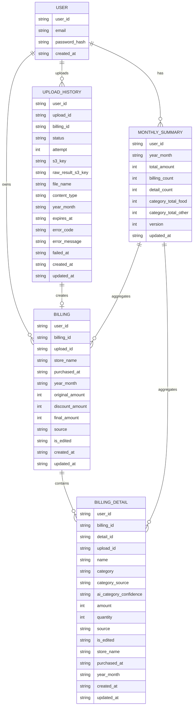

# DB設計

## 方針

DynamoDBのキー設計は、画面と非同期処理の検索条件から決める。

正規化されたERを先に作ってから検索時に無理をするのではなく、実際に必要なQuery / GetItem / UpdateItemを先に並べる。

GSIは本当に必要なものだけ作る。

---

## 解析精度と編集状態

明細テーブルには、初期構成では数値の信頼度カラムを持たせない。

AIの読み取り時点の確信度は、ユーザーが商品名や金額を修正した後の明細には意味が薄くなるため。

全件をユーザーが確認する運用にはしない。

```text
source
データの作成元

category_source
カテゴリの作成元

is_edited
ユーザーが後から編集したかどうか
```

解析結果をあとから検証したい場合は、明細にconfidenceを散らすのではなく、S3にOpenAIの生レスポンスJSONを保存し、`upload_histories.raw_result_s3_key` から参照する。

---

## ER図



---

## ユースケースと検索条件

| ユースケース | 主な呼び出し元 | 必要な検索条件 | 取得・更新対象 | DynamoDB操作 |
| --- | --- | --- | --- | --- |
| ログインする | `POST /auth/login` | emailでユーザーを1件取得 | User | GetItem |
| 月ごとの合計を見る | ダッシュボード画面 | user_idで月次集計を一覧取得 | monthly_summaries | Query |
| 指定月の支出内訳を見る | 月別支出画面 | user_id + year_monthで購入明細を金額降順取得 | billing_details | GSI Query |
| 指定月のアップロード履歴を見る | アップロード履歴画面 | user_id + year_monthでアップロード履歴を日時降順取得 | upload_histories | GSI Query |
| 請求詳細を見る | 請求詳細・編集画面 | user_id + billing_idで請求を1件取得 | billings | GetItem |
| 請求に含まれる商品を見る | 請求詳細・編集画面 | user_id + billing_idで購入明細を一覧取得 | billing_details | Query |
| 複数画像のアップロード枠を作る | アップロード画面 | user_id配下にupload_idを画像ごとに作成 | upload_histories | PutItem |
| S3アップロード完了を処理する | Analyze Lambda | S3キーからuser_id + upload_idを復元し履歴を更新 | upload_histories | UpdateItem |
| 解析結果を登録する | Analyze Lambda | user_id + upload_id + attemptを条件に登録 | upload_histories / billings / billing_details / monthly_summaries | TransactWriteItems |
| 解析失敗を記録する | Analyze Lambda | user_id + upload_idで履歴を更新 | upload_histories | UpdateItem |
| 解析を再実行する | `POST /uploads/{upload_id}/retry` | user_id + upload_idで履歴を更新 | upload_histories | UpdateItem |
| 請求を編集する | `PATCH /billings/{billing_id}` | user_id + billing_idで請求を更新し、billing_id配下の商品を更新 | billings / billing_details | TransactWriteItems |
| 月次集計を再計算する | `POST /monthly-summaries/{yyyy-MM}/recalculate` / 請求編集後 | user_idでbillingsを全件取得、user_id + year_monthでbilling_detailsを取得 | monthly_summaries | Query + UpdateItem |

---

## テーブル一覧

```text
users

monthly_summaries

upload_histories

billings

billing_details
```

---

## users

ログインはemailで行うため、emailを主キーにする。

user_idはJWTに入れて、ログイン後の各APIで利用する。

### Primary Key

| Key | Value |
| --- | --- |
| PK | `EMAIL#{email}` |

### Item

```jsonc
{
  "PK": "EMAIL#user@example.com", // ログイン用の主キー。emailからユーザーを直接取得する

  "type": "USER", // レコード種別

  "user_id": "01JUSERXXX", // アプリ内でユーザーを識別するID。JWTにも入れる
  "email": "user@example.com", // ログインに使うメールアドレス
  "password_hash": "$argon2id$...", // Argon2idでハッシュ化したパスワード

  "created_at": "2026-09-15T12:00:00Z" // ユーザーを作成した日時
}
```

### GSI

なし。

---

## monthly_summaries

月ごとの合計を保持する。

ダッシュボードの積み上げ棒グラフと、月別支出画面上部の円グラフで使う。

1ユーザー1月につき1レコードを作る。

月次集計の識別子は `user_id + year_month` とし、初回作成判定用のUUIDカラムは持たない。UUIDを持っても、同じ月の集計レコードを一意にする条件や再計算時の競合制御には使えないため。

カテゴリごとに月次集計レコードを複数作る設計にはしない。

カテゴリ別集計は `category_total_{category}` のトップレベル数値属性で持つ(カテゴリごとに1属性、最大10個)。map にしないのは、解析登録時にカテゴリごと `ADD` で原子的に加算するため。map の `SET` は並行処理でロストアップデートが起きる。API は `category_totals` の map に組み立てて返す。

AIの読み取り精度を考慮し、月の総額とカテゴリ別内訳は信頼度を分けて扱う。

月の総額は請求単位の `billings.final_amount` を正とする。

カテゴリ別内訳は `billing_details` の明細を元にする。

AI由来のカテゴリは参考値として扱い、ユーザーが修正した明細では修正後の `category` を優先する。

```text
月の総額
billings.final_amount の合計

カテゴリ別内訳
billing_details.amount を category ごとに合計
```

### Primary Key

| Key | Value |
| --- | --- |
| PK | `USER#{user_id}` |
| SK | `MONTH#{yyyy-MM}` |

### Query

| 用途 | 条件 |
| --- | --- |
| 月次集計一覧 | `PK = USER#{user_id}` and `SK begins_with MONTH#` |
| 指定月の集計 | `PK = USER#{user_id}` and `SK = MONTH#{yyyy-MM}` |

### Item

```jsonc
{
  "PK": "USER#01JUSERXXX", // ユーザー単位で月次集計をまとめるパーティションキー
  "SK": "MONTH#2026-09", // 対象年月を表すソートキー

  "type": "MONTHLY_SUMMARY", // レコード種別

  "year_month": "2026-09", // 集計対象の年月
  "total_amount": 128500, // 月の合計金額。billings.final_amountの合計
  "billing_count": 25, // 月内の請求件数
  "detail_count": 120, // 月内の購入明細件数
  "category_total_food": 86000, // 食費カテゴリの合計金額。カテゴリごとにトップレベル属性で持ち、ADD で加算する
  "category_total_daily_goods": 22500, // 日用品カテゴリの合計金額
  "category_total_other": 20000, // その他カテゴリの合計金額
  "category_total_unknown": 12000, // 分類できなかった明細の合計金額。登場していないカテゴリは属性なし(= 0)

  "version": 26, // 楽観ロック用。Analyze LambdaはADD、再計算はCondition付きSET

  "updated_at": "2026-09-15T12:01:00Z" // 集計を最後に更新した日時
}
```

### GSI

なし。

---

## upload_histories

請求書・レシート画像1枚単位のアップロード履歴と解析状態を保持する。

主キーは、S3イベントや再実行APIから `user_id + upload_id` で直接更新できる形にする。

月別の履歴一覧だけは主キーと検索条件が合わないため、GSIを1つ使う。

### Primary Key

| Key | Value |
| --- | --- |
| PK | `USER#{user_id}` |
| SK | `UPLOAD#{upload_id}` |

### GSI: upload_month_index

| Key | Value |
| --- | --- |
| GSI1PK | `USER#{user_id}#MONTH#{yyyy-MM}` |
| GSI1SK | `UPLOAD_CREATED_AT#{created_at}#{upload_id}` |

日時降順で表示する場合は `ScanIndexForward = false` を使う。

### Query

| 用途 | 条件 |
| --- | --- |
| アップロード履歴を直接取得 | `PK = USER#{user_id}` and `SK = UPLOAD#{upload_id}` |
| 指定月のアップロード履歴 | `GSI1PK = USER#{user_id}#MONTH#{yyyy-MM}` |

### Item

```jsonc
{
  "PK": "USER#01JUSERXXX", // ユーザー単位でアップロード履歴をまとめるパーティションキー
  "SK": "UPLOAD#01JUPLOADXXX", // アップロード画像1枚を識別するソートキー

  "GSI1PK": "USER#01JUSERXXX#MONTH#2026-09", // 月別アップロード履歴一覧用のGSIパーティションキー
  "GSI1SK": "UPLOAD_CREATED_AT#2026-09-15T12:00:00Z#01JUPLOADXXX", // アップロード日時順に並べるGSIソートキー

  "type": "UPLOAD_HISTORY", // レコード種別

  "upload_id": "01JUPLOADXXX", // アップロード画像1枚を識別するID
  "billing_id": "01JBILLXXX", // 解析成功後に作成された請求ID。解析前や失敗時は未設定

  "status": "SUCCEEDED", // アップロードおよび解析の状態。UPLOADING / ANALYZING / SUCCEEDED / NO_DATA / FAILED
  "attempt": 1, // 解析の試行回数。手動再実行のたびに+1。登録時の条件に使う
  "s3_key": "receipts/01JUSERXXX/01JUPLOADXXX/original.jpg", // 元画像を保存したS3キー
  "raw_result_s3_key": "analysis-results/01JUSERXXX/01JUPLOADXXX/1.json", // OpenAIの生レスポンスJSONを保存したS3キー。attemptごとに別ファイル。S3側は90日で削除されるため、古い履歴では参照先が無いことがある。レスポンスを保存できなかった失敗では未設定

  "file_name": "receipt.jpg", // ユーザーがアップロードした元ファイル名
  "content_type": "image/jpeg", // アップロード画像のContent-Type
  "year_month": "2026-09", // 履歴一覧で使う対象年月
  "expires_at": "2026-09-15T12:15:00Z", // Presigned URLの有効期限。画面側の期限切れ判定に使う

  "error_code": "NO_TOTAL_AMOUNT", // 失敗理由の列挙値。FAILED時のみ。NO_DATA時は未設定
  "error_message": "合計金額を取得できませんでした", // 失敗理由の詳細。FAILED時のみ
  "failed_at": "2026-09-15T12:01:00Z", // 失敗日時。FAILED時のみ

  "created_at": "2026-09-15T12:00:00Z", // アップロード枠を作成した日時
  "updated_at": "2026-09-15T12:01:00Z" // 履歴を最後に更新した日時
}
```

`error_code` / `error_message` / `failed_at` は再実行時に削除する。

### 失敗時のレコード

`FAILED` の場合も `upload_histories` は残す。`billings` / `billing_details` は作らないため、`billing_id` は未設定のまま。履歴画面から `error_code` を参照して理由を表示し、再実行を促す。

`NO_DATA` の場合も `upload_histories` は残す。解析は完了したが明細0件のため、`billings` / `billing_details` / `monthly_summaries` は作成・更新しない。`error_code` は使わず、履歴画面では「登録対象なし」として表示する。

---

## billings

請求単位の情報を保持する。

詳細表示と編集は `user_id + billing_id` で直接行う。

月別一覧は購入明細と月次集計から表示できるため、billingsには月別一覧用GSIを作らない。

### Primary Key

| Key | Value |
| --- | --- |
| PK | `USER#{user_id}` |
| SK | `BILLING#{billing_id}` |

### Query

| 用途 | 条件 |
| --- | --- |
| 請求詳細取得 | `PK = USER#{user_id}` and `SK = BILLING#{billing_id}` |
| 請求編集 | `PK = USER#{user_id}` and `SK = BILLING#{billing_id}` |

### Item

```jsonc
{
  "PK": "USER#01JUSERXXX", // ユーザー単位で請求をまとめるパーティションキー
  "SK": "BILLING#01JBILLXXX", // 請求1件を識別するソートキー

  "type": "BILLING", // レコード種別

  "billing_id": "01JBILLXXX", // 請求1件を識別するID
  "upload_id": "01JUPLOADXXX", // 元になったアップロード画像ID

  "store_name": "スーパー", // 購入店舗名
  "purchased_at": "2026-09-15", // 購入日
  "year_month": "2026-09", // 月次集計や月別表示で使う年月

  "original_amount": 3280, // レシート・請求書上の元の合計金額
  "discount_amount": 500, // 割り勘や値引きとしてあとから差し引く金額
  "final_amount": 2780, // 自分の支出として月次集計に反映する金額

  "source": "AI", // データの作成元。AIまたはMANUAL
  "is_edited": false, // ユーザーが後から編集したかどうか

  "created_at": "2026-09-15T12:00:00Z", // 請求レコードを作成した日時
  "updated_at": "2026-09-15T12:01:00Z" // 請求レコードを最後に更新した日時
}
```

### GSI

なし。

---

## billing_details

請求単位に紐づく購入明細を保持する。

主キーは請求詳細・編集に合わせて、`user_id + billing_id` で商品一覧をQueryできる形にする。

月別支出画面では `user_id + year_month` で購入明細を金額降順に取得したいため、GSIを1つ使う。

### Primary Key

| Key | Value |
| --- | --- |
| PK | `USER#{user_id}#BILLING#{billing_id}` |
| SK | `DETAIL#{detail_id}` |

### GSI: detail_month_amount_index

| Key | Value |
| --- | --- |
| GSI1PK | `USER#{user_id}#MONTH#{yyyy-MM}` |
| GSI1SK | `DETAIL_AMOUNT#{amount_desc_key}#{purchased_at}#{detail_id}` |

`amount_desc_key` は金額降順でQueryするためのソート用キー。

例:

```text
amount_desc_key = 9999999999 - amount
```

### Query

| 用途 | 条件 |
| --- | --- |
| 請求内の商品一覧 | `PK = USER#{user_id}#BILLING#{billing_id}` |
| 指定月の購入明細を金額降順で取得 | `GSI1PK = USER#{user_id}#MONTH#{yyyy-MM}` |

### Item

```jsonc
{
  "PK": "USER#01JUSERXXX#BILLING#01JBILLXXX", // 請求単位で購入明細をまとめるパーティションキー
  "SK": "DETAIL#01JITEMXXX", // 購入明細1件を識別するソートキー

  "GSI1PK": "USER#01JUSERXXX#MONTH#2026-09", // 月別購入明細一覧用のGSIパーティションキー
  "GSI1SK": "DETAIL_AMOUNT#9999999718#2026-09-15#01JITEMXXX", // 金額降順で並べるためのGSIソートキー

  "type": "BILLING_DETAIL", // レコード種別

  "detail_id": "01JITEMXXX", // 購入明細1件を識別するID
  "billing_id": "01JBILLXXX", // 紐づく請求ID
  "upload_id": "01JUPLOADXXX", // 元になったアップロード画像ID

  "name": "牛乳", // 商品名
  "category": "food", // 支出カテゴリ
  "category_source": "AI", // カテゴリの作成元。AI / USER / UNKNOWN
  "ai_category_confidence": "high", // AI分類の確信度。high / medium / low。USERやUNKNOWNでは未設定でもよい
  "amount": 281, // 商品単位の金額
  "quantity": 1, // 数量
  "source": "AI", // データの作成元。AIまたはMANUAL
  "is_edited": false, // ユーザーが後から編集したかどうか

  "store_name": "スーパー", // 購入店舗名。月別一覧で請求を再取得せず表示するために持つ
  "purchased_at": "2026-09-15", // 購入日。月別一覧で使う
  "year_month": "2026-09", // 月別一覧とGSIキー生成で使う年月

  "created_at": "2026-09-15T12:01:00Z", // 購入明細を作成した日時
  "updated_at": "2026-09-15T12:01:00Z" // 購入明細を最後に更新した日時
}
```

---

## GSI一覧

| GSI | テーブル | 目的 | 必要な理由 |
| --- | --- | --- | --- |
| upload_month_index | upload_histories | 月ごとの画像アップロード履歴一覧 | 主キーは `user_id + upload_id` の直接更新を優先するため |
| detail_month_amount_index | billing_details | 月ごとの購入明細を金額降順で表示 | 主キーは `billing_id` 配下の商品編集を優先するため |

初期構成で作るGSIはこの2つまでにする。

`billings` の月別一覧GSIは作らない。月ごとの画面は `monthly_summaries` と `billing_details` で成立する。

解析ジョブID用のGSIも作らない。SQSメッセージはS3キーか `user_id + upload_id` を持つので、主キーで直接引ける。

---

## 集計粒度

月次集計は以下の粒度で保持する。

| 集計対象 | 粒度 | 保存先 | 反映元 | 備考 |
| --- | --- | --- | --- | --- |
| 月合計 | 1ユーザー + 1月で1値 | `monthly_summaries.total_amount` | `billings.final_amount` | ダッシュボードの月合計で使う |
| 請求件数 | 1ユーザー + 1月で1値 | `monthly_summaries.billing_count` | `billings` | 画像解析成功後に作成された請求数 |
| 商品件数 | 1ユーザー + 1月で1値 | `monthly_summaries.detail_count` | `billing_details` | AIで読み取れた明細数 |
| カテゴリ別金額 | 1ユーザー + 1月 + 1カテゴリで1値 | `monthly_summaries.category_total_{category}` | `billing_details.category` + `billing_details.amount` | 円グラフと積み上げ棒グラフの内訳。API は map にして返す |

月合計はカテゴリ別金額の合計から作らない。

理由は、AIの読み取りでは請求合計より商品明細のほうが欠落・誤読・分割ミスが起きやすいため。

```text
OK:
monthly_summaries.total_amount = SUM(billings.final_amount)

NG:
monthly_summaries.total_amount = SUM(billing_details.amount)
```

カテゴリ別集計は画面表示用の補助集計とする。

カテゴリが推定できない場合は `unknown` に寄せる。

ユーザーがカテゴリを修正した場合は、月次再計算で `category_total_*` を作り直す。

---

## 更新と集計

### 解析成功時

`Analyze Lambda` はOpenAIの読み取り結果の検証後、以下を `TransactWriteItems` で処理する。

```text
1. upload_histories
   status = SUCCEEDED
   billing_id = 01JBILLXXX
   raw_result_s3_key = analysis-results/{user_id}/{upload_id}/{attempt}.json
   Condition: status = ANALYZING AND attempt = :attempt

2. billings
   Put

3. billing_details (最大50件)
   Put
   category / category_source を含める

4. monthly_summaries
   SET type / user_id / year_month if_not_exists
   ADD total_amount
   ADD billing_count
   ADD detail_count
   ADD category_total_{category}(登場したカテゴリのみ)
   ADD version
```

月次集計は `ADD` だけで更新し、読んだ値を元にした `SET` はしない。同じ月のレシートを並行処理してもカテゴリ別金額が後勝ちで消えないため。

二重処理と停滞していた前回処理の遅延登録を防ぐため、upload_histories側に条件を置く。

```text
Condition:
status = ANALYZING AND attempt = :attempt
```

TransactWriteItemsは100 itemまでのため、明細は50件を上限とする。これは初期構成のプロダクト仕様とし、超過した場合は請求を作成せず失敗として扱う。

AIがカテゴリを決められなかった明細は `category = unknown`、`category_source = AI` として登録する。

---

### 解析失敗時

以下のいずれかに該当する場合、`billings` / `billing_details` は作成せず、`upload_histories` のみ更新する。

```text
OpenAI APIの恒久エラー / JSON Schema不一致
合計金額が取れない、または範囲外
購入日が取れない、または実在しない・未来・古すぎる
明細50件超
永久失敗(ValidationError)
```

```text
upload_histories
  Condition: status = ANALYZING AND attempt = :attempt
  status = FAILED
  error_code = 理由
  error_message = 詳細
  failed_at = 現在時刻
  raw_result_s3_key = analysis-results/{user_id}/{upload_id}/{attempt}.json(レスポンスを保存できた場合のみ)
```

明細0件の場合は失敗ではなく、解析完了だが登録対象なしとして扱う。

```text
upload_histories
  Condition: status = ANALYZING AND attempt = :attempt
  status = NO_DATA
  raw_result_s3_key = analysis-results/{user_id}/{upload_id}/{attempt}.json
  error_code / error_message / failed_at は未設定
```

`raw_result_s3_key` は SUCCEEDED / FAILED / NO_DATA のいずれでも、OpenAI のレスポンスを S3 に保存できていれば同じ状態更新の中で設定する。API 呼び出し自体が失敗してレスポンスが無い場合(`ANALYSIS_FAILED` の一部、`INTERNAL`)は未設定のまま。

失敗記録にも `attempt` 条件を付けるのは、古い試行の遅い失敗処理が新しい試行の結果を上書きしないため。条件失敗は正常終了する。

---

### 再実行時

```text
upload_histories
  Condition: status IN (FAILED, NO_DATA, ANALYZING)
  status = ANALYZING
  attempt = attempt + 1
  REMOVE error_code, error_message, failed_at
```

---

### 月次再計算時

`monthly_summaries` を元データから作り直す。集計がズレたときの復旧と、請求編集時の反映に使う。

```text
1. monthly_summariesを取得し、versionを控える
   レコードが存在しない場合は version = 0 とみなす

2. billingsを取得
   PK = USER#{user_id} and SK begins_with BILLING#
   year_monthでフィルタ

3. billing_detailsを取得
   detail_month_amount_index
   GSI1PK = USER#{user_id}#MONTH#{yyyy-MM}

4. monthly_summaries更新
   Condition: attribute_not_exists(PK) OR version = :v
   SET total_amount    = SUM(billings.final_amount)
   SET billing_count   = COUNT(billings)
   SET detail_count    = COUNT(billing_details)
   SET category_total_{category} = SUM(billing_details.amount) GROUP BY category(全カテゴリ、無ければ 0)
   SET type / user_id / year_month
   SET version         = if_not_exists(version, 0) + 1
```

条件失敗した場合(再計算中にAnalyze Lambdaが `ADD` した場合)は 1 からやり直す。

billingsに月別GSIは作らない。月あたりの請求数は数十件のため、user_id配下を全件取得してフィルタすれば十分。

---

### 請求編集時

請求詳細画面で `discount_amount` や商品金額・カテゴリを変更した場合、`billings` / `billing_details` を更新した後、月次再計算を実行する。

```text
1. billings / billing_details更新
   final_amount = original_amount - discount_amount
   is_edited = true
   カテゴリを変更した明細は category_source = USER
   billing_detailsのGSI1SKも更新

2. 月次再計算
   同じ月なら当月のみ
   purchased_atの月が変わる場合は旧月と新月
```

差分更新は行わない。差分計算の競合や月またぎ・カテゴリ変更の複雑さを避ける。

---

## 保留事項

円グラフと積み上げ棒グラフの内訳は `category` を使う前提にする。

カテゴリを以下のどちらで決めるかは別途決める。

```text
AIの読み取り時に自動分類する

ユーザーが請求詳細・編集画面で手動修正する
```
