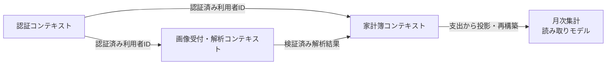
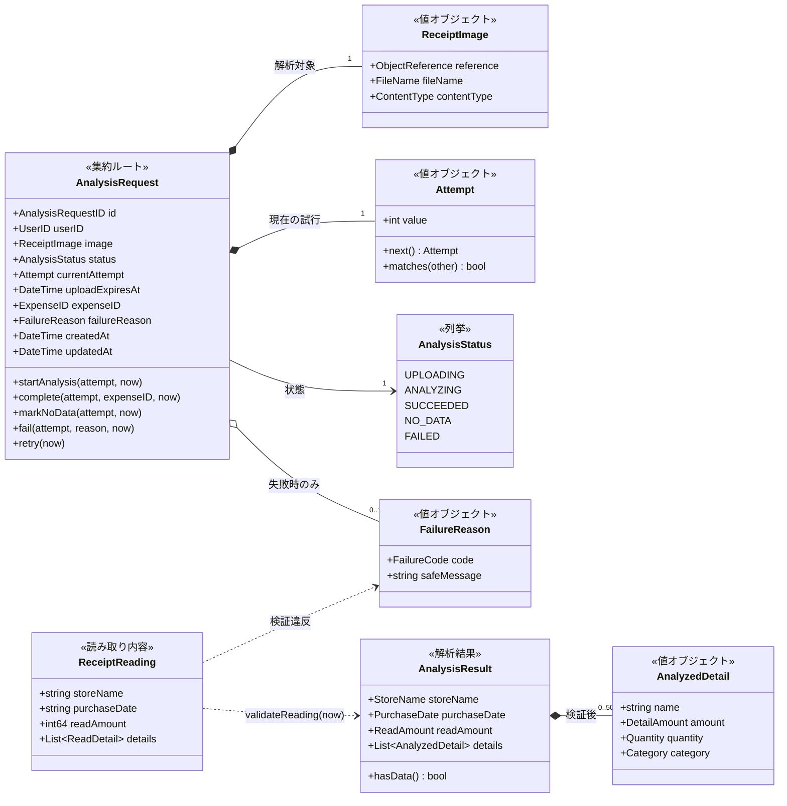
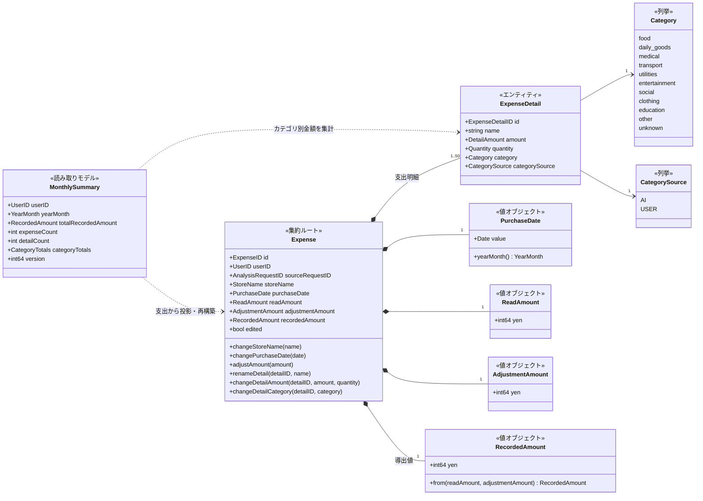
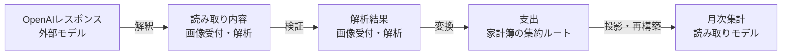

# ドメインモデル図

## 目的

本書は、snap_kakeibo のドメインモデル、集約境界、モデル間の関係を図示する。

用語の意味は[ユビキタス言語](./ubiquitous-language.md)、境界とルールの詳細は[ドメイン境界とモデル](./domain-model.md)を正とする。本図はドメインモデルを表し、DynamoDBの属性やAPIのキーは[DB設計](../infra/database.md)と各画面の仕様を参照する。

## コンテキスト間の関係

月次集計は独立したコンテキストではなく、家計簿コンテキスト内の読み取りモデルである。

## 画像受付・解析コンテキスト

読み取り内容(`ReceiptReading`)はOpenAIのレスポンスを解釈した検証前の値で、読めなかった項目を持たないことがある。`validateReading`が業務上の検証を行い、検証済みの解析結果(`AnalysisResult`)か失敗理由(`FailureReason`)を返す。明細が0件の場合は支出を作らず、解析依頼を`NO_DATA`にする。

解析中の依頼を再解析可能とする条件と、停滞と判定する時間は未決定のため、図では`retry`の詳細な事前条件を固定しない。

## 家計簿コンテキスト

## コンテキスト境界での変換

- OpenAIレスポンスの型を解析結果として使用しない。
- 解析結果の型を支出集約へ直接持ち込まず、application層で変換する。
- 月次集計は支出と支出明細から導出し、支出へ逆反映しない。

## 集約境界のルール

- 解析依頼と支出は別の集約とし、互いをIDで参照する。
- 支出明細は支出集約の内部に置き、支出を経由して変更する。
- 1つの支出が持つ支出明細は1件以上50件以下とする。
- 計上額は`読取金額 + 調整額`から導出し、直接変更しない。
- 計上額は返金を表現できるように負数を許容する。
- 月次集計は集約ではなく、家計簿コンテキストの読み取りモデルとする。
- DynamoDBの条件式とトランザクションは、集約のルールを並行処理下でも保証するために使用する。
