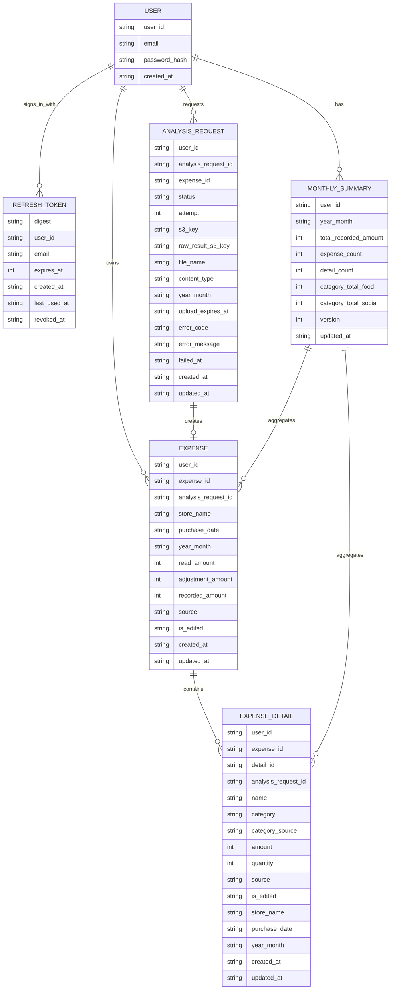

# DB設計

## 方針

DynamoDBのキー設計は、画面と非同期処理の検索条件から決める。

正規化されたERを先に作ってから検索時に無理をするのではなく、実際に必要なQuery / GetItem / UpdateItemを先に並べる。

GSIは本当に必要なものだけ作る。

---

## 解析精度と編集状態

明細テーブルには、初期構成では数値の信頼度カラムを持たせない。

AIの読み取り時点の確信度は、ユーザーが商品名や金額を修正した後の明細には意味が薄くなるため。

全件をユーザーが確認する運用にはしない。

```text
source
データの作成元

category_source
カテゴリの作成元

is_edited
ユーザーが後から編集したかどうか
```

解析結果をあとから検証したい場合は、明細にconfidenceを散らすのではなく、S3にOpenAIの生レスポンスJSONを保存し、`analysis_requests.raw_result_s3_key` から参照する。

---

## ER図



---

## ユースケースと検索条件

| ユースケース | 主な呼び出し元 | 必要な検索条件 | 取得・更新対象 | DynamoDB操作 |
| --- | --- | --- | --- | --- |
| ログインする | `POST /auth/login` | emailでユーザーを1件取得し、refresh tokenを発行 | users / refresh_tokens | GetItem / PutItem |
| ログイン試行を制限する | `POST /auth/login` | IP・emailごとの試行回数を固定時間窓で加算 | users(LOGIN_ATTEMPT) | UpdateItem |
| access tokenを更新する | `POST /auth/refresh` | Cookieのrefresh tokenのdigestで1件取得し、失効させて再発行 | refresh_tokens | GetItem / UpdateItem / PutItem |
| ログアウトする | `POST /auth/logout` | Cookieのrefresh tokenのdigestで失効 | refresh_tokens | UpdateItem |
| 全端末からログアウトする | パスワード変更など(未実装) | user_idで未失効のrefresh tokenを一覧し失効 | refresh_tokens | GSI Query + UpdateItem |
| 月ごとの合計を見る | ダッシュボード画面 | user_idで月次集計を一覧取得 | monthly_summaries | Query |
| 指定月の支出内訳を見る | 月別支出画面 | user_id + year_monthで支出明細を金額降順取得 | expense_details | GSI Query |
| 指定月の解析依頼を見る | 解析履歴画面 | user_id + year_monthで状態を絞り、解析依頼を日時降順・20件単位で取得。登録完了分の店舗名・計上額を補う | analysis_requests / expenses | GSI Query / BatchGetItem |
| 支出詳細を見る | 支出詳細・編集画面 | user_id + expense_idで支出を1件取得 | expenses | GetItem |
| 支出に含まれる支出明細を見る | 支出詳細・編集画面 | user_id + expense_idで支出明細を一覧取得 | expense_details | Query |
| 複数画像のアップロード枠を作る | アップロード画面 | user_id配下にanalysis_request_idを画像ごとに作成 | analysis_requests | PutItem |
| S3アップロード完了を処理する | Analyze Lambda | S3キーからuser_id + analysis_request_idを復元し解析依頼を更新 | analysis_requests | UpdateItem |
| 解析結果を登録する | Analyze Lambda | user_id + analysis_request_id + attemptを条件に登録 | analysis_requests / expenses / expense_details / monthly_summaries | TransactWriteItems |
| 解析失敗を記録する | Analyze Lambda | user_id + analysis_request_idで解析依頼を更新 | analysis_requests | UpdateItem |
| 再解析する | `POST /analysis-requests/{analysis_request_id}/retry` | user_id + analysis_request_idで解析依頼を更新 | analysis_requests | UpdateItem |
| 支出を編集する | `PATCH /expenses/{expense_id}` | user_id + expense_idで支出を更新し、expense_id配下の支出明細を更新 | expenses / expense_details | TransactWriteItems |
| 月次集計を再構築する | `POST /monthly-summaries/{yyyy-MM}/rebuild` / 支出編集後 | user_idでexpensesを全件取得、user_id + year_monthでexpense_detailsを取得 | monthly_summaries | Query + UpdateItem |

---

## テーブル一覧

```text
users

refresh_tokens

monthly_summaries

analysis_requests

expenses

expense_details
```

テーブル名・属性名は [ユビキタス言語](../ddd/ubiquitous-language.md) に合わせる。旧名称(`upload_histories` / `billings` / `billing_details`、`billing_id` / `upload_id` / `original_amount` / `discount_amount` / `final_amount`)のテーブルと属性は持たず、旧データからの移行経路も用意しない。

---

## users

ログインはemailで行うため、emailを主キーにする。

user_idはJWTに入れて、ログイン後の各APIで利用する。

### Primary Key

| Key | Value |
| --- | --- |
| PK | `EMAIL#{email}` |

### Item

```jsonc
{
  "PK": "EMAIL#user@example.com", // ログイン用の主キー。emailからユーザーを直接取得する

  "type": "USER", // レコード種別

  "user_id": "01JUSERXXX", // アプリ内でユーザーを識別するID。JWTにも入れる
  "email": "user@example.com", // ログインに使うメールアドレス
  "password_hash": "$argon2id$...", // Argon2idでハッシュ化したパスワード

  "created_at": "2026-09-15T12:00:00Z" // ユーザーを作成した日時
}
```

### GSI

なし。

### ログイン試行カウンタ

ログインのレート制限用カウンタも `users` に置く。emailやIPアドレスをそのまま残さないよう識別子はSHA-256でハッシュ化し、固定時間窓(5分)ごとに1アイテム作る。

`expires_at` はUnix秒で、テーブルのTTL属性として自動削除の対象になる。ユーザーアイテムは `expires_at` を持たないため消えない。

```jsonc
{
  "PK": "LOGIN_ATTEMPT#{sha256(subject)}#{window_start_unix}", // subjectは "ip:..." または "email:..."

  "attempt_count": 3, // 窓内の試行回数。ADDで原子的に加算し、上限に達したら条件式で拒否する
  "expires_at": 1758369600 // TTL。窓の終了から1時間後に削除される
}
```

---

## refresh_tokens

ログイン時に発行するrefresh tokenを保持する。ユーザー本体とは更新単位が異なる(ログイン・更新・ログアウトのたびに書き換わり、端末ごとに複数持つ)ため、`users` とは別テーブルにする。

クライアントに返すraw tokenは保存せず、SHA-256のdigestだけを主キーに使う。refresh時はdigestで1件を強整合に取得し、使用済みトークンを失効させてから新しいトークンを発行する(rotation)。

期限切れはTTLで自動削除する。失効済み(`revoked_at` あり)のトークンも期限までは残し、TTLで消える。

### Primary Key

| Key | Value |
| --- | --- |
| PK | `REFRESH#{digest}` |

### GSI: refresh_token_user_index

| Key | Value |
| --- | --- |
| GSI1PK | `USER#{user_id}` |
| GSI1SK | `REFRESH_CREATED_AT#{created_at}#{digest}` |

ユーザー単位の一覧・一括失効(全端末ログアウト、パスワード変更)に使う。GSIは結果整合のため、直前に発行されたトークンを取りこぼす可能性は許容する。

### Query

| 用途 | 条件 |
| --- | --- |
| refresh tokenを照合 | `PK = REFRESH#{digest}`(ConsistentRead) |
| ユーザーの未失効トークン一覧 | `GSI1PK = USER#{user_id}` and `attribute_not_exists(revoked_at)` |

### Item

```jsonc
{
  "PK": "REFRESH#3f9a...", // raw tokenのSHA-256 digest。raw tokenは保存しない
  "GSI1PK": "USER#01JUSERXXX", // ユーザー単位で一覧するGSIパーティションキー
  "GSI1SK": "REFRESH_CREATED_AT#2026-09-15T12:00:00Z#3f9a...", // 発行日時順に並べるGSIソートキー

  "type": "REFRESH_TOKEN", // レコード種別

  "user_id": "01JUSERXXX", // トークンの所有者
  "email": "user@example.com", // refresh時にユーザーを再取得するためのキー
  "expires_at": 1760961600, // 有効期限(Unix秒)。TTL属性
  "created_at": "2026-09-15T12:00:00Z", // 発行日時
  "last_used_at": "2026-09-15T12:00:00Z", // 最後に使われた日時
  "refresh_hint": "Ab3dEf9h", // raw tokenの末尾8文字。サポート時の突き合わせ用
  "revoked_at": "2026-09-16T09:00:00Z" // 失効日時。未失効なら属性なし
}
```

---

## monthly_summaries

月ごとの合計を保持する。

ダッシュボードの積み上げ棒グラフと、月別支出画面上部の円グラフで使う。

1ユーザー1月につき1レコードを作る。

月次集計の識別子は `user_id + year_month` とし、初回作成判定用のUUIDカラムは持たない。UUIDを持っても、同じ月の集計レコードを一意にする条件や再構築時の競合制御には使えないため。

カテゴリごとに月次集計レコードを複数作る設計にはしない。

カテゴリ別集計は `category_total_{category}` のトップレベル数値属性で持つ(カテゴリごとに1属性、最大10個)。map にしないのは、解析登録時にカテゴリごと `ADD` で原子的に加算するため。map の `SET` は並行処理でロストアップデートが起きる。API は `category_totals` の map に組み立てて返す。

AIの読み取り精度を考慮し、月の総額とカテゴリ別内訳は信頼度を分けて扱う。

月の総額は支出単位の `expenses.recorded_amount`(計上額)を正とする。

カテゴリ別内訳は `expense_details` の明細を元にする。

AI由来のカテゴリは参考値として扱い、ユーザーが修正した明細では修正後の `category` を優先する。

```text
月の総額
expenses.recorded_amount の合計

カテゴリ別内訳
expense_details.tax_included_amount があればその値、なければ印字額の amount を category ごとに合計
```

### Primary Key

| Key | Value |
| --- | --- |
| PK | `USER#{user_id}` |
| SK | `MONTH#{yyyy-MM}` |

### Query

| 用途 | 条件 |
| --- | --- |
| 月次集計一覧 | `PK = USER#{user_id}` and `SK begins_with MONTH#` |
| 指定月の集計 | `PK = USER#{user_id}` and `SK = MONTH#{yyyy-MM}` |

### Item

```jsonc
{
  "PK": "USER#01JUSERXXX", // ユーザー単位で月次集計をまとめるパーティションキー
  "SK": "MONTH#2026-09", // 対象年月を表すソートキー

  "type": "MONTHLY_SUMMARY", // レコード種別

  "year_month": "2026-09", // 集計対象の年月
  "total_recorded_amount": 128500, // 月の計上額合計。expenses.recorded_amountの合計
  "expense_count": 25, // 月内の支出件数
  "detail_count": 120, // 月内の支出明細件数
  "confirmed_detail_count": 80, // 税込み明細額を確認できた件数。旧データで属性がなければ0
  "category_total_food": 86000, // 食費カテゴリの合計金額。カテゴリごとにトップレベル属性で持ち、ADD で加算する
  "category_total_daily_goods": 22500, // 日用品カテゴリの合計金額
  "category_total_social": 15000, // 交際・会食カテゴリの合計金額
  "category_total_other": 5000, // その他カテゴリの合計金額
  "category_total_unknown": 12000, // 分類できなかった明細の合計金額。登場していないカテゴリは属性なし(= 0)

  "version": 26, // 楽観ロック用。Analyze LambdaはADD、再構築はCondition付きSET

  "updated_at": "2026-09-15T12:01:00Z" // 集計を最後に更新した日時
}
```

### GSI

なし。

---

## analysis_requests

レシート画像1枚単位の解析依頼(受付から解析の終端まで)を保持する。

主キーは、S3イベントや再解析APIから `user_id + analysis_request_id` で直接更新できる形にする。

月別の一覧だけは主キーと検索条件が合わないため、GSIを1つ使う。

### Primary Key

| Key | Value |
| --- | --- |
| PK | `USER#{user_id}` |
| SK | `ANALYSIS_REQUEST#{analysis_request_id}` |

### GSI: analysis_request_month_index

| Key | Value |
| --- | --- |
| GSI1PK | `USER#{user_id}#MONTH#{yyyy-MM}` |
| GSI1SK | `ANALYSIS_REQUEST_CREATED_AT#{created_at}#{analysis_request_id}` |

日時降順で表示する場合は `ScanIndexForward = false` を使う。

### Query

| 用途 | 条件 |
| --- | --- |
| 解析依頼を直接取得 | `PK = USER#{user_id}` and `SK = ANALYSIS_REQUEST#{analysis_request_id}` |
| 指定月の解析依頼 | `GSI1PK = USER#{user_id}#MONTH#{yyyy-MM}` |

### Item

```jsonc
{
  "PK": "USER#01JUSERXXX", // ユーザー単位で解析依頼をまとめるパーティションキー
  "SK": "ANALYSIS_REQUEST#01JREQUESTXXX", // レシート画像1枚の解析依頼を識別するソートキー

  "GSI1PK": "USER#01JUSERXXX#MONTH#2026-09", // 月別解析依頼一覧用のGSIパーティションキー
  "GSI1SK": "ANALYSIS_REQUEST_CREATED_AT#2026-09-15T12:00:00Z#01JREQUESTXXX", // 作成日時順に並べるGSIソートキー

  "type": "ANALYSIS_REQUEST", // レコード種別

  "analysis_request_id": "01JREQUESTXXX", // 解析依頼を識別するID
  "expense_id": "01JEXPENSEXXX", // 解析成功後に作成された支出ID。解析前や失敗時は未設定

  "status": "SUCCEEDED", // 解析依頼の状態。UPLOADING / ANALYZING / SUCCEEDED / NO_DATA / FAILED
  "attempt": 1, // 解析試行番号。再解析のたびに+1。登録時の条件に使う
  "s3_key": "receipts/01JUSERXXX/01JREQUESTXXX/original.jpg", // 元画像を保存したS3キー
  "raw_result_s3_key": "analysis-results/01JUSERXXX/01JREQUESTXXX/1/resp_01JRESPONSEXXX.json", // OpenAIの生レスポンスJSONを保存したS3キー。responseごとに別ファイル。S3側は90日で削除されるため、古い解析依頼では参照先が無いことがある。レスポンスを保存できなかった失敗では未設定

  "file_name": "receipt.jpg", // ユーザーがアップロードした元ファイル名
  "content_type": "image/jpeg", // アップロード画像のContent-Type
  "year_month": "2026-09", // 一覧で使う対象年月(作成日時のUTCの月)
  "upload_expires_at": "2026-09-15T12:15:00Z", // Presigned URLの有効期限。画面側の期限切れ判定に使う

  "error_code": "NO_TOTAL_AMOUNT", // 失敗理由の列挙値。FAILED時のみ。NO_DATA時は未設定
  "error_message": "合計金額を取得できませんでした", // 失敗理由の詳細。FAILED時のみ
  "failed_at": "2026-09-15T12:01:00Z", // 失敗日時。FAILED時のみ

  "created_at": "2026-09-15T12:00:00Z", // アップロード枠を作成した日時
  "updated_at": "2026-09-15T12:01:00Z" // 解析依頼を最後に更新した日時
}
```

`error_code` / `error_message` / `failed_at` は再解析時に削除する。

読み出し時は `analysis/domain.AnalysisRequest` の集約へ復元し、状態と付随する値(SUCCEEDED なら `expense_id`、FAILED なら `error_code`)の整合を検証する。

### 失敗時のレコード

`FAILED` の場合も `analysis_requests` は残す。`expenses` / `expense_details` は作らないため、`expense_id` は未設定のまま。解析依頼一覧画面から `error_code` を参照して理由を表示し、再解析を促す。

`NO_DATA` の場合も `analysis_requests` は残す。解析は完了したが明細0件のため、`expenses` / `expense_details` / `monthly_summaries` は作成・更新しない。`error_code` は使わず、解析依頼一覧画面では「登録対象なし」として表示する。

---

## expenses

支出単位の情報を保持する。

詳細表示と編集は `user_id + expense_id` で直接行う。

月別一覧は支出明細と月次集計から表示できるため、expensesには月別一覧用GSIを作らない。

### Primary Key

| Key | Value |
| --- | --- |
| PK | `USER#{user_id}` |
| SK | `EXPENSE#{expense_id}` |

### Query

| 用途 | 条件 |
| --- | --- |
| 支出詳細取得 | `PK = USER#{user_id}` and `SK = EXPENSE#{expense_id}` |
| 支出編集 | `PK = USER#{user_id}` and `SK = EXPENSE#{expense_id}` |

### Item

```jsonc
{
  "PK": "USER#01JUSERXXX", // ユーザー単位で支出をまとめるパーティションキー
  "SK": "EXPENSE#01JEXPENSEXXX", // 支出1件を識別するソートキー

  "type": "EXPENSE", // レコード種別

  "expense_id": "01JEXPENSEXXX", // 支出1件を識別するID
  "analysis_request_id": "01JREQUESTXXX", // 元になった解析依頼ID

  "store_name": "スーパー", // 購入店舗名
  "purchase_date": "2026-09-15", // 購入日(時刻を含まない暦日)
  "year_month": "2026-09", // 月次集計や月別表示で使う年月

  "read_amount": 3280, // 読取金額。レシートに記載された最終支払合計(店舗側の値引き・税は反映済み)
  "analysis_evidence": "{...}", // AI解析時のみ。採用した金額候補、税区分、照合状態と根拠のJSON
  "adjustment_amount": -500, // 調整額。利用者が加減する符号付き金額。減額は負数、増額は正数
  "recorded_amount": 2780, // 計上額。read_amount + adjustment_amount。月次集計に反映し、負数を許容する

  "source": "AI", // データの作成元。AIまたはMANUAL
  "is_edited": false, // ユーザーが後から編集したかどうか

  "created_at": "2026-09-15T12:00:00Z", // 支出レコードを作成した日時
  "updated_at": "2026-09-15T12:01:00Z" // 支出レコードを最後に更新した日時
}
```

`recorded_amount` は導出値で、読み出し時は `read_amount + adjustment_amount` から再計算して集約を復元する。

### GSI

なし。

---

## expense_details

支出単位に紐づく支出明細を保持する。

主キーは支出詳細・編集に合わせて、`user_id + expense_id` で明細一覧をQueryできる形にする。

月別支出画面では `user_id + year_month` で支出明細を金額降順に取得したいため、GSIを1つ使う。

### Primary Key

| Key | Value |
| --- | --- |
| PK | `USER#{user_id}#EXPENSE#{expense_id}` |
| SK | `DETAIL#{detail_id}` |

### GSI: detail_month_amount_index

| Key | Value |
| --- | --- |
| GSI1PK | `USER#{user_id}#MONTH#{yyyy-MM}` |
| GSI1SK | `DETAIL_AMOUNT#{amount_desc_key}#{purchase_date}#{detail_id}` |

`amount_desc_key` は金額降順でQueryするためのソート用キー。
税込み明細額を確認できた行はその額、未確定行は印字額をキーに使う。金額を編集した場合はキーを更新する。

例:

```text
amount_desc_key = 2147483647 - amount(10 桁ゼロ埋め)
```

### Query

| 用途 | 条件 |
| --- | --- |
| 支出内の支出明細一覧 | `PK = USER#{user_id}#EXPENSE#{expense_id}` |
| 指定月の支出明細を金額降順で取得 | `GSI1PK = USER#{user_id}#MONTH#{yyyy-MM}` |

### Item

```jsonc
{
  "PK": "USER#01JUSERXXX#EXPENSE#01JEXPENSEXXX", // 支出単位で支出明細をまとめるパーティションキー
  "SK": "DETAIL#01JITEMXXX", // 支出明細1件を識別するソートキー

  "GSI1PK": "USER#01JUSERXXX#MONTH#2026-09", // 月別支出明細一覧用のGSIパーティションキー
  "GSI1SK": "DETAIL_AMOUNT#2147483366#2026-09-15#01JITEMXXX", // 金額降順で並べるためのGSIソートキー

  "type": "EXPENSE_DETAIL", // レコード種別

  "detail_id": "01JITEMXXX", // 支出明細1件を識別するID
  "expense_id": "01JEXPENSEXXX", // 紐づく支出ID
  "analysis_request_id": "01JREQUESTXXX", // 元になった解析依頼ID

  "name": "牛乳", // 商品名
  "category": "food", // 支出カテゴリ(social を含む定義済みの語彙)
  "category_source": "AI", // カテゴリの決定元。AI / USER
  "amount": 281, // 商品行の印字額(数量を反映した1行の金額)。既存API契約を維持
  "tax_included_amount": 303, // 根拠を確認できた税込み明細額。未確定では属性なし
  "tax_rate": 8, // 商品別に確認できた税率。未確定では属性なし
  "tax_mode": "external", // included / external / mixed / unknown
  "tax_status": "reconciled", // printed / reconciled / estimated / unresolved / user_confirmed。旧データは未設定
  "tax_reason": "amount_constraints", // 判定根拠のコード
  // "suggested_tax_rate": 8, // estimated の候補のみ。tax_rate と区別し集計に使わない
  "tax_allocation": "receipt_tax_proportional_v1", // printed_included、印字税額の比例配分、利用者確認時は user_confirmed。未確定では空
  "quantity": 1, // 数量
  "source": "AI", // データの作成元。AIまたはMANUAL
  "is_edited": false, // ユーザーが後から編集したかどうか

  "store_name": "スーパー", // 購入店舗名。月別一覧で支出を再取得せず表示するために持つ
  "purchase_date": "2026-09-15", // 購入日。月別一覧で使う
  "year_month": "2026-09", // 月別一覧とGSIキー生成で使う年月

  "created_at": "2026-09-15T12:01:00Z", // 支出明細を作成した日時
  "updated_at": "2026-09-15T12:01:00Z" // 支出明細を最後に更新した日時
}
```

---

## GSI一覧

| GSI | テーブル | 目的 | 必要な理由 |
| --- | --- | --- | --- |
| analysis_request_month_index | analysis_requests | 月ごとの解析依頼一覧 | 主キーは `user_id + analysis_request_id` の直接更新を優先するため |
| detail_month_amount_index | expense_details | 月ごとの支出明細を金額降順で表示 | 主キーは `expense_id` 配下の明細編集を優先するため |

初期構成で作るGSIはこの2つまでにする。

`expenses` の月別一覧GSIは作らない。月ごとの画面は `monthly_summaries` と `expense_details` で成立する。

解析ジョブID用のGSIも作らない。SQSメッセージはS3キーか `user_id + analysis_request_id` を持つので、主キーで直接引ける。

---

## 集計粒度

月次集計は以下の粒度で保持する。

| 集計対象 | 粒度 | 保存先 | 反映元 | 備考 |
| --- | --- | --- | --- | --- |
| 計上額合計 | 1ユーザー + 1月で1値 | `monthly_summaries.total_recorded_amount` | `expenses.recorded_amount` | ダッシュボードの月合計で使う |
| 支出件数 | 1ユーザー + 1月で1値 | `monthly_summaries.expense_count` | `expenses` | 画像解析成功後に作成された支出数 |
| 明細件数 | 1ユーザー + 1月で1値 | `monthly_summaries.detail_count` | `expense_details` | AIで読み取れた明細数 |
| 税込み確定明細件数 | 1ユーザー + 1月で1値 | `monthly_summaries.confirmed_detail_count` | `expense_details.tax_included_amount` がある行 | 未確定件数の表示に使う |
| カテゴリ別金額 | 1ユーザー + 1月 + 1カテゴリで1値 | `monthly_summaries.category_total_{category}` | `expense_details.category` + 確定した `tax_included_amount`、未確定なら `amount` | 積み上げ棒グラフの内訳。API は map にして返す |

月合計はカテゴリ別金額の合計から作らない。

理由は、AIの読み取りでは支払合計より商品明細のほうが欠落・誤読・分割ミスが起きやすいため。

```text
OK:
monthly_summaries.total_recorded_amount = SUM(expenses.recorded_amount)

NG:
monthly_summaries.total_recorded_amount = SUM(expense_details.amount)
```

カテゴリ別集計は画面表示用の補助集計とする。

カテゴリが推定できない場合は `unknown` に寄せる。

ユーザーがカテゴリを修正した場合は、月次再構築で `category_total_*` を作り直す。

### 既存データの移行

1. 新しいバックエンドを先に配布し、`GET /expenses/{expense_id}` と `GET /months/{yyyy-MM}/expenses` の追加属性を確認する。`amount` は従来の印字額のままで、旧明細に `tax_included_amount` は付けない。税率別税額や支払合計との差額から旧明細を一括換算しない。
2. 利用者ごとに `GET /monthly-summaries` で対象月を列挙し、認証された利用者の `POST /monthly-summaries/{yyyy-MM}/rebuild` を各月に一度実行する。再構築は支出・明細を正本にして `category_total_*`、`confirmed_detail_count`、`detail_count` を作り直す。各月の `total_recorded_amount` が再構築前後で等しいことを確認する。
3. 旧データで税率と商品行の対応が確認できないものは未確定のまま表示する。利用者が印字額を編集した行の税込み根拠は破棄する。利用者がレシートと照らして税区分・税率・税込み明細額を確認した場合は `PATCH /expenses/{expense_id}` で保存できる。編集済み明細を再解析結果で自動上書きせず、個別の確認後に保存する。

バックエンドとフロントエンドを独立して配布する間、追加 API 属性は省略可能として読む。旧月次集計に `confirmed_detail_count` がない場合は 0 件として扱う。新しい登録・編集処理は対象月の集計を新契約で更新するが、既存の月を完全に揃えるため上記の再構築を実行する。

---

## 更新と集計

### 解析成功時

`Analyze Lambda` はOpenAIの読み取り結果の検証後、以下を `TransactWriteItems` で処理する。

```text
1. analysis_requests
   status = SUCCEEDED
   expense_id = 01JEXPENSEXXX
   raw_result_s3_key = analysis-results/{user_id}/{analysis_request_id}/{attempt}/{response_id}.json
   Condition: status = ANALYZING AND attempt = :attempt

2. expenses
   Put(read_amount = 合計金額、adjustment_amount = 0、recorded_amount = read_amount)

3. expense_details (最大50件)
   Put
   category / category_source を含める

4. monthly_summaries
   SET type / user_id / year_month if_not_exists
   ADD total_recorded_amount
   ADD expense_count
   ADD detail_count
   ADD category_total_{category}(登場したカテゴリのみ)
   ADD version
```

月次集計は `ADD` だけで更新し、読んだ値を元にした `SET` はしない。同じ月のレシートを並行処理してもカテゴリ別金額が後勝ちで消えないため。

二重処理と停滞していた前回処理の遅延登録を防ぐため、analysis_requests側に条件を置く。

```text
Condition:
status = ANALYZING AND attempt = :attempt
```

TransactWriteItemsは100 itemまでのため、明細は50件を上限とする。これは初期構成のプロダクト仕様とし、超過した場合は支出を作成せず失敗として扱う。

AIがカテゴリを決められなかった明細は `category = unknown`、`category_source = AI` として登録する。

---

### 解析失敗時

以下のいずれかに該当する場合、`expenses` / `expense_details` は作成せず、`analysis_requests` のみ更新する。

```text
OpenAI APIの恒久エラー / JSON Schema不一致
合計金額が取れない、または範囲外
購入日が取れない、または実在しない・未来・古すぎる
明細50件超
永久失敗(ValidationError)
```

```text
analysis_requests
  Condition: status = ANALYZING AND attempt = :attempt
  status = FAILED
  error_code = 理由
  error_message = 詳細
  failed_at = 現在時刻
  raw_result_s3_key = analysis-results/{user_id}/{analysis_request_id}/{attempt}/{response_id}.json(レスポンスを保存できた場合のみ)
```

明細0件の場合は失敗ではなく、解析完了だが登録対象なしとして扱う。

```text
analysis_requests
  Condition: status = ANALYZING AND attempt = :attempt
  status = NO_DATA
  raw_result_s3_key = analysis-results/{user_id}/{analysis_request_id}/{attempt}/{response_id}.json
  error_code / error_message / failed_at は未設定
```

`raw_result_s3_key` は SUCCEEDED / FAILED / NO_DATA のいずれでも、OpenAI のレスポンスを S3 に保存できていれば同じ状態更新の中で設定する。API 呼び出し自体が失敗してレスポンスが無い場合(`ANALYSIS_FAILED` の一部、`INTERNAL`)は未設定のまま。

失敗記録にも `attempt` 条件を付けるのは、古い試行の遅い失敗処理が新しい試行の結果を上書きしないため。条件失敗は正常終了する。

---

### 再解析時

```text
analysis_requests
  Condition: status IN (FAILED, NO_DATA, ANALYZING)
  status = ANALYZING
  attempt = attempt + 1
  REMOVE error_code, error_message, failed_at
```

---

### 月次再構築時

`monthly_summaries` を支出と支出明細から作り直す。集計がズレたときの復旧と、支出編集時の反映に使う。

```text
1. monthly_summariesを取得し、versionを控える
   レコードが存在しない場合は version = 0 とみなす

2. expensesを取得
   PK = USER#{user_id} and SK begins_with EXPENSE#
   year_monthでフィルタ

3. expense_detailsを取得
   detail_month_amount_index
   GSI1PK = USER#{user_id}#MONTH#{yyyy-MM}

4. monthly_summaries更新
   Condition: attribute_not_exists(PK) OR version = :v
   SET total_recorded_amount = SUM(expenses.recorded_amount)
   SET expense_count         = COUNT(expenses)
   SET detail_count          = COUNT(expense_details)
   SET confirmed_detail_count = COUNT(expense_details.tax_included_amount がある行)
   SET category_total_{category} = SUM(確定時 tax_included_amount、未確定時 amount) GROUP BY category(全カテゴリ、無ければ 0)
   SET type / user_id / year_month
   SET version               = if_not_exists(version, 0) + 1
```

条件失敗した場合(再構築中にAnalyze Lambdaが `ADD` した場合)は 1 からやり直す。

expensesに月別GSIは作らない。月あたりの支出数は数十件のため、user_id配下を全件取得してフィルタすれば十分。

---

### 支出編集時

支出詳細画面で `adjustment_amount` や明細金額・カテゴリを変更した場合、`expenses` / `expense_details` を更新した後、月次再構築を実行する。

```text
1. expenses / expense_details更新
   recorded_amount = read_amount + adjustment_amount
   is_edited = true
   カテゴリを変更した明細は category_source = USER
   expense_detailsのGSI1SKも更新

2. 月次再構築
   同じ月なら当月のみ
   purchase_dateの月が変わる場合は旧月と新月
```

差分更新は行わない。差分計算の競合や月またぎ・カテゴリ変更の複雑さを避ける。

---

## 保留事項

円グラフと積み上げ棒グラフの内訳は `category` を使う前提にする。

カテゴリを以下のどちらで決めるかは別途決める。

```text
AIの読み取り時に自動分類する

ユーザーが支出詳細・編集画面で手動修正する
```

## 税率補完の追加属性（#105）

`analysis_evidence` に印・注記の対応、税込対象額、商品別値引き、元の読み取りと補完結果、探索結果を保存する。明細には `tax_status` / `tax_reason` / `suggested_tax_rate` を追加する。推定では `tax_included_amount` を設定せず、集計は印字額を使う。新しい属性がない旧レコードも読める。移行・一括更新は実行しない。

属性の意味と更新条件は[商品別税率の補完](../receipt-tax-inference.md#保存と表示)を参照する。
